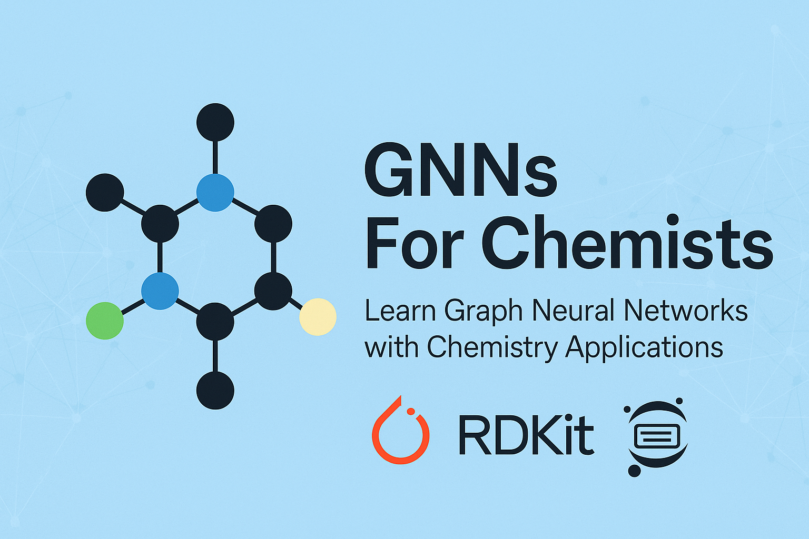

<p align="center">
  
</p>

# GNNs For Chemists

<p align="center">
  <a href="https://colab.research.google.com/github/HFooladi/GNNs-For-Chemists/blob/main/notebooks/01_GNN_representation.ipynb"></a>
  <a href="LICENSE"></a>
  
  <a href="https://github.com/HFooladi/GNNs-For-Chemists/stargazers"></a>
</p>

Learn graph neural networks by building them from scratch on real molecules. Every notebook runs in Google Colab with one click, and **no prior experience with GNNs is required** - we build the concepts from the ground up.

## Start Here

**In the browser (recommended):** [](https://colab.research.google.com/github/HFooladi/GNNs-For-Chemists/blob/main/notebooks/01_GNN_representation.ipynb) Start with Notebook 01 and work through the core sequence below.

**Locally:**

```bash
git clone https://github.com/HFooladi/GNNs-For-Chemists.git
```

Then open any notebook in `notebooks/`. Each notebook installs its own dependencies in the first cell.

## Project Description

This repository serves as an educational resource for chemists and researchers interested in applying Graph Neural Networks to chemical problems. Each notebook progressively builds upon fundamental concepts, from basic graph representation of molecules to advanced molecular property prediction models.

## Prerequisites

To get the most out of this tutorial series, you should have:

- **Python**: Basic to intermediate Python programming skills
- **Chemistry**: Fundamental understanding of molecular structures and properties
- **Machine Learning**: Basic familiarity with neural network concepts
- **Mathematics**: Basic understanding of linear algebra and calculus fundamentals
- **Packages**: Familiarity with PyTorch, NumPy, and RDKit (installation instructions provided in notebooks)

## Resources

### Core Tutorial Sequence
The following notebooks (01, 02, 03, ...) form the **main learning path** and are essential for understanding GNN fundamentals:

| Notebook | Description | Open in Colab | Status |
| -------- | ----------- | -------------- | ------ |
| [01_GNN_representation](notebooks/01_GNN_representation.ipynb) | Representing molecules as graphs | [](https://colab.research.google.com/github/HFooladi/GNNs-For-Chemists/blob/main/notebooks/01_GNN_representation.ipynb) | ✅ |
| [02_GNN_message_passing](notebooks/02_GNN_message_passing.ipynb) | Understanding the message-passing concept | [](https://colab.research.google.com/github/HFooladi/GNNs-For-Chemists/blob/main/notebooks/02_GNN_message_passing.ipynb) | ✅ |
| [03_GNN_molecular_activity_predictor](notebooks/03_GNN_molecular_activity_predictor.ipynb) | Build and train the first GNN | [](https://colab.research.google.com/github/HFooladi/GNNs-For-Chemists/blob/main/notebooks/03_GNN_molecular_activity_predictor.ipynb) | ✅ |
| [04_GNN_GCN](notebooks/04_GNN_GCN.ipynb) | Graph convolutional network | [](https://colab.research.google.com/github/HFooladi/GNNs-For-Chemists/blob/main/notebooks/04_GNN_GCN.ipynb) | ✅ |
| [05_GNN_GAT](notebooks/05_GNN_GAT.ipynb) | Graph attention network | [](https://colab.research.google.com/github/HFooladi/GNNs-For-Chemists/blob/main/notebooks/05_GNN_GAT.ipynb) | ✅ |
| [06_GNN_GIN](notebooks/06_GNN_GIN.ipynb) | Graph isomorphism network | [](https://colab.research.google.com/github/HFooladi/GNNs-For-Chemists/blob/main/notebooks/06_GNN_GIN.ipynb) | ✅ |
| 07_GNN_SchNet | SchNet: continuous-filter convolutions on 3D atomic positions | _coming soon_ | 🚧 |
| 08_GNN_DimNet | DimeNet: directional message passing with bond angles | _coming soon_ | 🚧 |
| 09_GNN_EGNN | E(3)-equivariant graph neural network | _coming soon_ | 🚧 |
| 10_GNN_GT | Graph Transformer / Graphormer | _coming soon_ | 🚧 |

### Supplementary Deep-Dive Notebooks
These notebooks (01.1, 01.2, ...) provide **additional details and advanced topics** that complement the main series:

| Notebook | Description | Open in Colab | Status |
| -------- | ----------- | -------------- | ------ |
| [01.1_GNN_3D_representation](notebooks/01.1_GNN_3D_representation.ipynb) | Interactive 3D molecular visualizations and stereochemistry | [](https://colab.research.google.com/github/HFooladi/GNNs-For-Chemists/blob/main/notebooks/01.1_GNN_3D_representation.ipynb) | ✅ |
| 01.2_GNN_alternative_representations | Alternative graph encodings: dual graphs, atom-bond networks | _coming soon_ | 🚧 |
| 01.3_GNN_fragment_representation | Fragment-based molecular representations (BRICS, functional groups, ring systems) | _coming soon_ | 🚧 |
| 01.4_GNN_frameworks | Framework comparison: PyTorch Geometric vs. DGL vs. Jraph | _coming soon_ | 🚧 |
| [01.5_GNN_graph_characteristics](notebooks/01.5_GNN_graph_characteristics.ipynb) | What molecular graphs look like statistically — size, sparsity, degree, diameter — and why GNNs use 3–5 layers | [](https://colab.research.google.com/github/HFooladi/GNNs-For-Chemists/blob/main/notebooks/01.5_GNN_graph_characteristics.ipynb) | ✅ |
| [02.1_GNN_oversmoothing](notebooks/02.1_GNN_oversmoothing.ipynb) | Visualizing oversmoothing: why very deep GNNs fail | [](https://colab.research.google.com/github/HFooladi/GNNs-For-Chemists/blob/main/notebooks/02.1_GNN_oversmoothing.ipynb) | ✅ |


## Contributing

Contributions are welcome! Please see [CONTRIBUTORS.md](CONTRIBUTORS.md) for guidelines on how to contribute.

## License

This project is licensed under the MIT License - see the LICENSE file for details.

If this repository helped you, a ⭐ on GitHub helps other chemists find it.

## Citation

If you use this repository in your research, please cite it as:

```bibtex
@misc{gnns_for_chemists,
  author = {Fooladi, Hosein},
  title = {GNNs For Chemists: Implementations of Graph Neural Networks from Scratch for Chemical Applications},
  year = {2025},
  publisher = {GitHub},
  journal = {GitHub repository},
  howpublished = {\url{https://github.com/HFooladi/GNNs-For-Chemists}},
  note = {Educational resource for chemists, pharmacists, and researchers interested in applying Graph Neural Networks to chemical problems}
}
```
